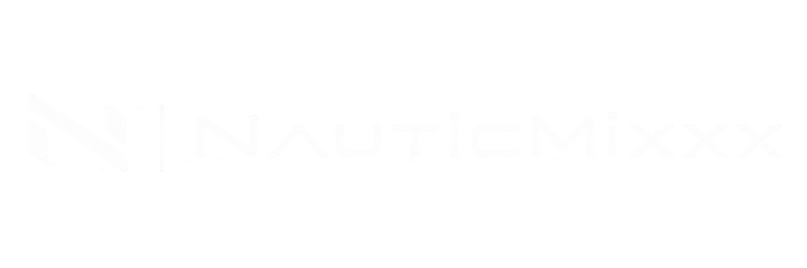

# NauticMixxx 1.0.0



NauticMixxx es una edición comunitaria y de código abierto de Mixxx 2.5.6,
diseñada para ofrecer un flujo visual de dos decks inspirado en una cabina
XDJ-RX3 y una integración profunda con Hercules DJControl Inpulse 500.

La versión 1.0.0 reúne la aplicación nativa, la skin, el mapping, los Sound
Color FX, el navegador de USB rekordbox y los parches reproducibles en una sola
distribución verificable.

## Qué incluye

- Interfaz 1280×800 escalable con vistas PERFORMANCE, BROWSE y STATUS.
- Waveforms apiladas, beat grid perimetral, overview y ocho Hot Cues por deck.
- Navegación y carga exclusiva desde USB preparado por rekordbox; el asistente,
  el escaneo y las fuentes de biblioteca musical local están bloqueados.
- Mapping específico para Hercules DJControl Inpulse 500.
- Cuatro Sound Color FX y controles de loop adaptados al hardware.
- Pantalla de arranque, icono y estado sin pistas con identidad NauticMixxx.
- Corrección de reapertura de SOURCE/USB durante la reproducción.
- Fuentes, parches, pruebas y checksums para auditar cada release.

## Descargar e instalar

Los archivos publicables se generan en `release/1.0.0/`:

- `NauticMixxx-1.0.0-macOS-arm64.dmg`
- `NauticMixxx-1.0.0-Windows-x64.zip`
- `NauticMixxx-1.0.0-macOS-arm64.zip`
- `NauticMixxx-1.0.0-source.tar.gz`
- `NauticMixxx-1.0.0-skin.zip`
- `SHA256SUMS.txt` y `release-manifest.json`

En macOS, abre el DMG, arrastra **NauticMixxx.app** a Aplicaciones y ábrela.
El ZIP contiene la misma aplicación como descarga alternativa. La
compilación local está firmada de forma ad hoc; una publicación general debe
firmarse y notarizarse con una cuenta Apple Developer. Consulta
[`docs/INSTALLATION.md`](docs/INSTALLATION.md).

En Windows 10/11 x64, extrae por completo el ZIP y ejecuta únicamente
`INSTALL-WINDOWS.cmd`. El asistente detecta Mixxx y la versión estable vigente;
ofrece una instalación paralela segura o un reemplazo avanzado con copia de
seguridad y confirmación explícita. El artefacto se genera desde la misma base y
los mismos diez parches mediante GitHub Actions; consulta
[`docs/INSTALLATION.md`](docs/INSTALLATION.md) y
[`docs/BUILDING.md`](docs/BUILDING.md).

## Verificar una descarga

```bash
cd release/1.0.0
shasum -a 256 -c SHA256SUMS.txt
```

## Probar la versión vigente

La aplicación lista para la prueba física está en
`release/1.0.0/NauticMixxx-1.0.0-macOS-arm64/NauticMixxx.app`. Conecta el Hercules DJControl Inpulse 500,
abre esa aplicación y sigue [`docs/HARDWARE_TEST.md`](docs/HARDWARE_TEST.md).

## Desarrollo y release

```bash
./scripts/validate-release.sh
python3 scripts/package-release.py
```

La compilación nativa de macOS se reproduce con:

```bash
./scripts/build-mixxx-rx3-macos.sh
```

## Estructura del repositorio

- `patches/`: cambios reproducibles aplicados sobre Mixxx 2.5.6.
- `controllers/`, `effects/`, `skins/` y `profile/`: componentes de NauticMixxx.
- `scripts/` y `packaging/`: compilación, distribución y verificación.
- `release/1.0.0/`: artefactos locales; los binarios públicos se adjuntan a GitHub Releases.

Documentación:

- [Instalación](docs/INSTALLATION.md)
- [Compilación reproducible](docs/BUILDING.md)
- [Pruebas y alcance de 1.0](docs/TESTING.md)
- [Prueba física de los seis fixes](docs/HARDWARE_TEST.md)
- [Organización y política de limpieza](docs/WORKSPACE.md)
- [Cómo publicar el release](docs/RELEASING.md)
- [Arquitectura](docs/ARCHITECTURE.md)
- [Cambios](CHANGELOG.md)
- [Contribuir](CONTRIBUTING.md)

## Licencia y marcas

El trabajo de NauticMixxx se publica bajo GNU GPL v3. El motor Mixxx conserva
GNU GPL v2 o posterior y sus avisos. Consulta [LICENSE.md](LICENSE.md) y
[THIRD_PARTY_NOTICES.md](THIRD_PARTY_NOTICES.md).

NauticMixxx no es un producto oficial ni está afiliado a los titulares de las
marcas mencionadas. Consulta [TRADEMARKS.md](TRADEMARKS.md).
