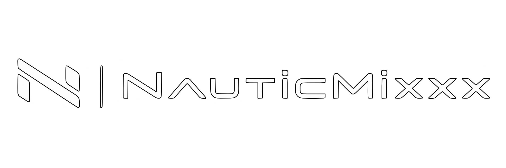
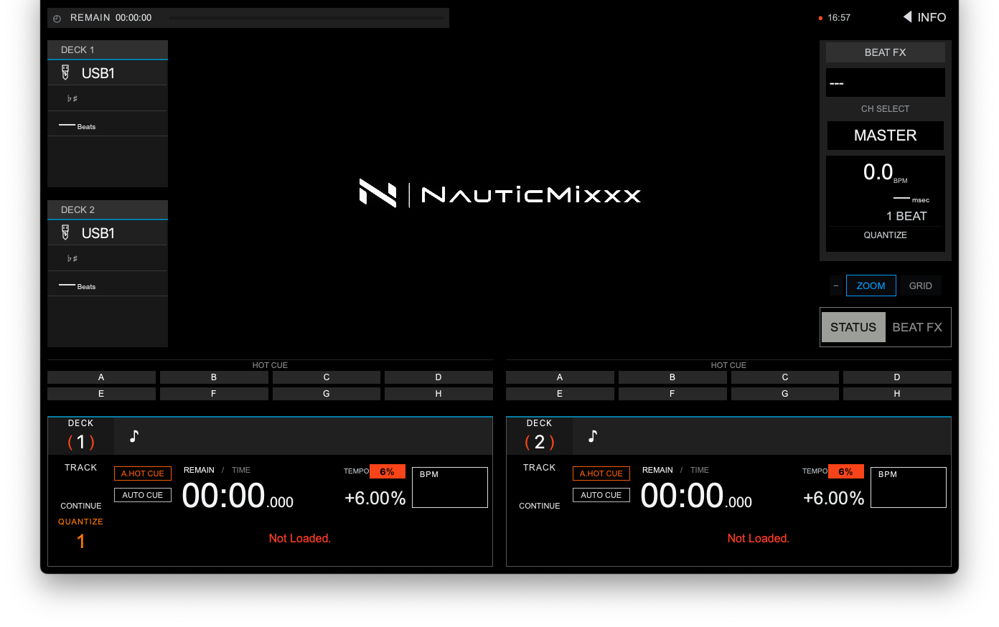
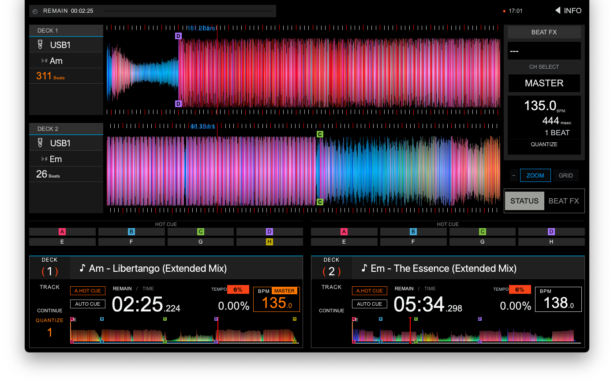

# NauticMixxx 1.9.0

Version 1.9.0 adds immediate USB category previews, paired browse columns,
touch search and temporary USB folder playback. Performance adds an active deck
selection outline, two-second BROWSER hold for GRID editing and selected-deck
encoder/tools. It refines pad labels, BEAT JUMP buttons, numeric typography and
the deck playback badge. The macOS RX3 window is frameless at 1280×800.
See the [browser guide](docs/BROWSER-NAVIGATION-1.9.md) and
[performance GRID guide](docs/PERFORMANCE-GRID-1.9.md).
Available for macOS Apple Silicon and Windows x64.





NauticMixxx is an open-source community edition of Mixxx 2.5.6. It brings an XDJ-RX3-inspired two-deck display to Mixxx, with a dedicated Hercules DJControl Inpulse 500 mapping.

## Features

- Scalable PERFORMANCE, BROWSE and STATUS views with stacked waveforms, beatgrid, overviews and eight Hot Cues per deck.
- Rekordbox USB browsing and loading in the native NauticMixxx app. Its local music-folder browser and scanner are disabled.
- Hercules DJControl Inpulse 500 mapping with RX3-style browser and loop controls.
- Optional DDJ-FLX4 mapping with RX3 browser controls. Its bindings passed software validation; physical hardware validation is pending. See the [DDJ-FLX4 guide](docs/DDJ-FLX4-EN.md).
- v1.5 presets add mouse-free RX3 browsing for DDJ-400, DDJ-SX, DDJ-SX2, DDJ-SX3, DDJ-WeGO3 and Roland DJ-505; see the [controller guide](docs/CONTROLLERS-RX3-1.5-EN.md). Hardware validation is pending.
- Optional DDJ-FLX6 **browser-only** preset for VIEW, SOURCE, BROWSE, BACK and LOAD 1/2. It does not replace a full controller mapping; see the [DDJ-FLX6 guide](docs/DDJ-FLX6-EN.md).
- Four Sound Color FX, NauticMixxx branding, reproducible patches, tests and release checksums.

## Download and install

Download NauticMixxx 1.9.0 from the [release page](https://github.com/nauticsoftware/NauticMixxx/releases/tag/v1.9.0):

- [macOS Apple Silicon DMG](https://github.com/nauticsoftware/NauticMixxx/releases/download/v1.9.0/NauticMixxx-1.9.0-macOS-arm64.dmg)
- [Windows x64 installer](https://github.com/nauticsoftware/NauticMixxx/releases/download/v1.9.0/NauticMixxx-1.9.0-Windows-x64-Setup.exe)

The Windows installer includes the native NauticMixxx program, RX3 skin, controller mappings and effects. The app and profile are separate from official Mixxx. Uninstall from Windows Settings; personal settings remain in `%LOCALAPPDATA%\NauticMixxx`.

On macOS, open the DMG and drag `NauticMixxx.app` to Applications. This build is ad-hoc signed rather than Apple-notarized, so macOS may ask you to confirm its first launch. See the [English installation guide](docs/INSTALLATION-EN.md).

## Verify a download

After downloading the release files into one directory, run:

```bash
shasum -a 256 -c SHA256SUMS.txt
```

On Windows, use PowerShell's `Get-FileHash -Algorithm SHA256` and compare the result with `SHA256SUMS.txt`.

## Test or build

### Linux and Raspberry Pi

A free native build recipe is available for 64-bit Linux. Raspberry Pi 4 with
64-bit Raspberry Pi OS is an experimental target; physical GPU, audio and
controller testing is pending. Read the [Linux / Raspberry Pi guide](docs/LINUX-RASPBERRY-PI.md)
for dependencies, memory settings, troubleshooting and free GitHub Actions builds.

Native builds, RX3 tests and virtual GUI startup passed on
[Ubuntu 24.04 x86_64 and ARM64](https://github.com/nauticsoftware/NauticMixxx/actions/runs/37158960601)
and [Debian 12 ARM64](https://github.com/nauticsoftware/NauticMixxx/actions/runs/37159816188).
The Bookworm build uses Debian's userland; it still needs physical Pi testing.

```sh
./scripts/install-linux-build-deps.sh
RX3_BUILD_JOBS=1 ./scripts/build-mixxx-rx3-linux.sh
```

The script downloads the official Mixxx base and applies the NauticMixxx patches.
Compiling this overlay repository's root directly does not work. Linux artifacts
are distribution-specific test candidates, rather than universal Pi installers.

### macOS and controller tests

For a physical Inpulse 500 test, follow the [hardware test guide](docs/HARDWARE_TEST.md). The optional FLX6 browser mapping has been checked in software but has not yet been tested on physical DDJ-FLX6 hardware.

To validate the source checkout or build the native macOS app:

```bash
./scripts/validate-release.sh
./scripts/build-mixxx-rx3-macos.sh
```

The `patches/` directory contains changes against Mixxx 2.5.6. `controllers/`, `effects/`, `skins/` and `profile/` hold the NauticMixxx components; `scripts/` and `packaging/` contain build and release tooling. Downloadable binaries, the manifest and checksums are attached to [GitHub Releases](https://github.com/nauticsoftware/NauticMixxx/releases).

More documentation: [validation](docs/VALIDATION-1.1.md), [architecture](docs/ARCHITECTURE.md), [changelog](CHANGELOG.md), [contributing](CONTRIBUTING.md) and [release process](docs/RELEASING.md).

## License and trademarks

NauticMixxx components are released under GNU GPL v3. The Mixxx engine retains its GNU GPL v2-or-later terms and notices. See [LICENSE.md](LICENSE.md) and [third-party notices](THIRD_PARTY_NOTICES.md). NauticMixxx is not an official product of, or affiliated with, the trademark owners named in the [trademark notice](TRADEMARKS.md).
